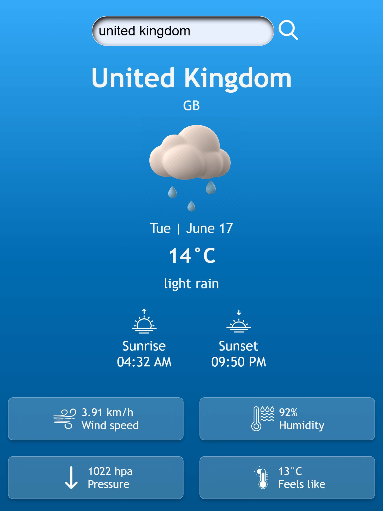

# 🌦️ Weather App

## 📌 Overview

A lightweight, user-friendly weather application that delivers accurate current weather conditions for any global location. Built with simplicity in mind, it provides essential weather data at a glance.

## ✨ Key Features

- **Instant Weather Updates**: Get real time temperature, humidity, and wind data
- **Visual Weather Indicators**: Dynamic icons for clear, cloudy, rainy, and other conditions
- **Daylight Tracking**: Precise sunrise and sunset times
- **Universal Access**: Fully responsive design for all devices
- **Smart Error Management**: Handles invalid inputs and connection issues

## 🔗 [Live Demo](https://Weather-App.vercel.app/)

📸 

## 🛠️ Core Technologies

- **Frontend**: Vanilla JavaScript (ES6+), HTML5, CSS3
- **Data Source**: OpenWeatherMap API (free tier)
- **Assets**: Custom weather icons and error graphics

## 🚨 Error Handling

- **city names** (shows error image)

- **Network connectivity issues**

- **API request failures**

## 🖥️ Usage

1. **Enter a city name in the search field**

2. **Click the search button or press Enter**

### 🔎 View current weather information including:

- **Temperature (°C)**

- **Weather description**

- **Humidity and wind speed**

- **Atmospheric pressure**

- **Sunrise/sunset times**

- **"Feels like" temperature**

## 🚀 Quick Start

1. **Get API Key**:

   - Register at [OpenWeatherMap](https://home.openweathermap.org/users/sign_up)
   - Obtain your free API key

2. **Configure App**:
   ```javascript
   // In script.js
   const apiKey = "paste_your_key_here"; // Keep this secure!
   ```
